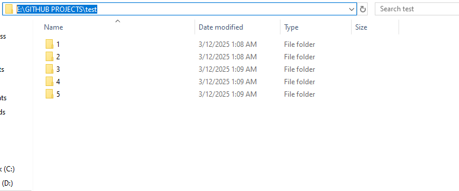
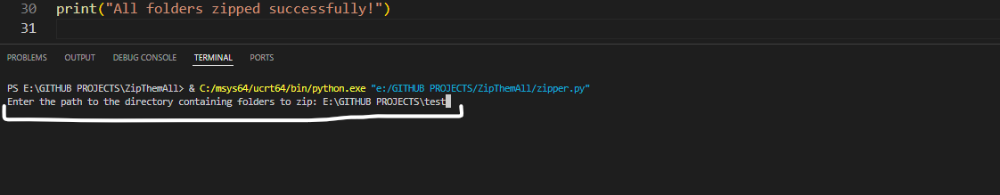
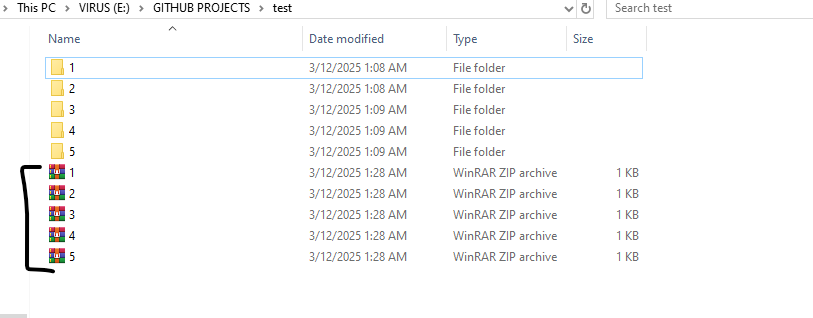

# 💀ZipThemAll💀  

## 📜Description  
A Simple Python Script That Can Help You Alot .....  
it can zip tons of folders just in one click !  

## 🚀SETUP  
1) Open the script in VS Code.  
2) Run the script.  
3) Enter the path of the folder in terminal below it ask for.  
4) Path ? (Open the folder and copy the path/link from the top)  
   example {E:\test\test}.  
5) press enter (in vs code terminal after entring path).  

## 📂EXAMPLE SS !  

